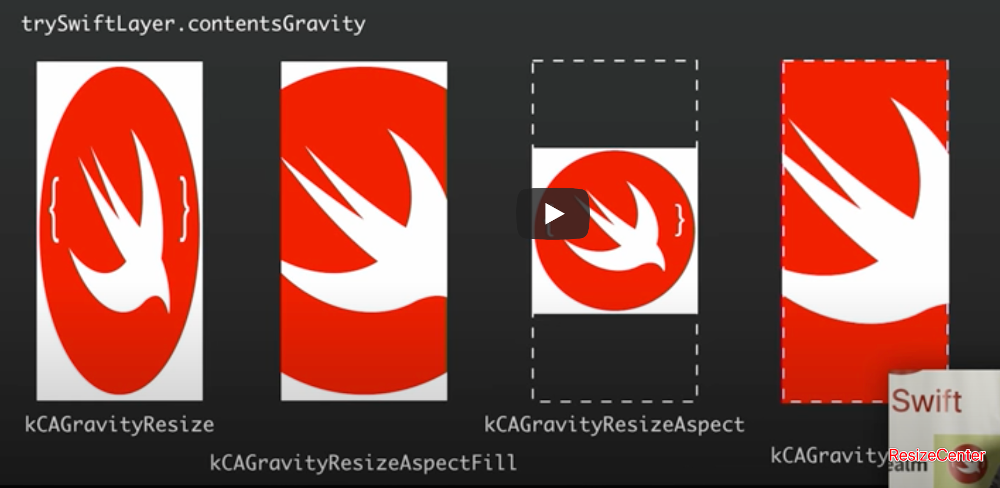
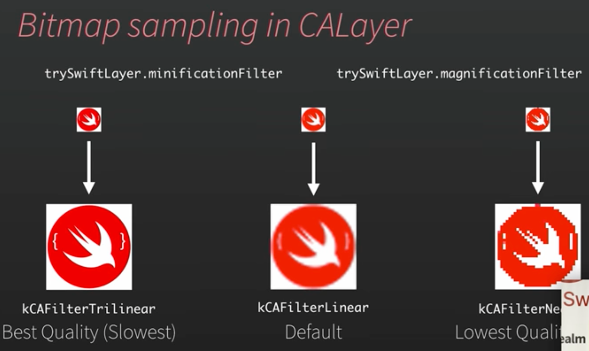
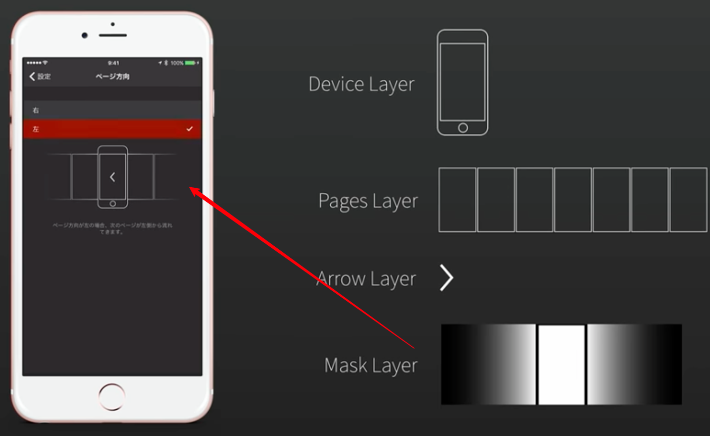

# Core Animation

[Source](https://academy.realm.io/posts/tryswift-tim-oliver-advanced-graphics-with-core-animation/)

**Core Graphics**

* Core Animation is supposed to be the graphics system of the framework, but there is also Core Graphics.
* Core Graphics is entirely done on the CPU, and cannot be performed on the GPU. 
  * Because it is an entirely CPU-bound operation
*  you can **combine** it with Core Animation.
  * You can use `Core Graphics` to create the actual bitmaps, and use `Core Animation` to display them to create some cool effects.

**Core Animation**

* It is comprised of a series of **layout objects**. >>> typically `CALayer`

```swift
import QuartzCore

let newLayer = CALayer()
newLayer.frame = CGRectMake(0, 0, 100, 100)
newLayer.backgroundColor = UIColor.redColor().CGColor
newLayer.cornerRadius = 10
```

**UIKit**

* Everything you see when you look at a `UIView` is **not** being done on the `UIView` level, but by a **backing layer** attached to that view.
* The layer is providing the **visual content**, 
*  `UIView` is providing **other** things:
  * order layout functionality, touch recognition, guest recognizers.

```swift
public class UIView {
   public var layer: CALayer { get }
}
```

**为什么不让UIView直接继承CALayer**

* CALayer确实有自己的子类
* 它们可以插入UIView的subLayer中，并指定其为暴露的那个layer，这种设计决定了它需要有一个“容器"
* 比如用一个渐变的layer子类来替换原来的layer:

```swift
public class MyGradientClass : UIView {
    override class func layerClass() -> AnyClass {
       return CAGradientLayer.self
    }
}
```

* Mapping contents to CALayer: `someLayer.contents = someImage.CGImage`
  * the `.contents` property is `animatable`

Scale (with `contentGravity` property):



* 场景一：屏幕向下拉，背景图越变越大（根据设置的填充和变形方式，以及容器的frame）
* 场景二：类似macOS的docker，鼠标（滑块/slider）在图标上滚过的时候放大，处理为一个滑块，和左右两个layer，分别设置了只显示左边或右边的`gravity`


> 我本以为是两张页码背景图是**重合**的，根据滑块位置来“切”掉对应的左侧图和右侧图，但是显然这个方案是左右两个背景图是**并列**的，它同时改的两个图的frame(其实就是width加起来永远是100%)，然后设置resize的方案是让左边的从左显示起，右边的从中显示起就行了
>
> 但仔细一想，仍然可以理解为两张图是重合的，分别往左右两方去resize使得两张图的frame并不相交而已

场景二的其它方案：

* Because this method leverages the GPU, it is incredibly performant. 
* There are other ways you could have gone about doing this. 
  * For example, using a masking layer, or doing it in Core Graphics. 
  * But, because both of them would have leveraged the CPU, it would have been slower.

**Bitmap Sampling in CALayer**

* Core Animation also **exposes settings** that lets you configure which resizing resampling algorithms the GPU uses.
* Whenever you change the size of a layer and the size **no longer matches the original size** of the bitmap mapped to it, resampling needs to be done to make sure it does not look *jagged* or *distorted*.
  * By default, the sampling mode that Core Animation uses is called **bilinear filtering** (`kCAFilterLinear`), a simple linear interpolation between two pixels. (线性插值最快)
  * Sometimes, even bilinear filtering is too `slow`. If you are rapidly resizing a frame during animation, you might get stuttering.
    * 这时可以使用 nearest (`kCAFilterNearest`). Nearest mode completely **disables** pixel resampling. 
  * trilinear filtering (`kCAFilterTrilinear`) 则能提供最好的resampling质量，the GPU will generate **differently sized versions** of the same bitmap, and **blend them together** to create resizing of the texture in question. 
    * 最慢，而且把CPU也拉进来了



最近邻插值图像质量最差，但也最省资源最快速，用在动画切换场景（视频里演示了app退到桌面时，app的icon由当前app界面的截图逐渐变回logo的过程，这个截图显然就不需要高质量的图片）

* 同时也暗示了在图片展示区域本来就很小时，也没必要应用高质量scale
* 或者动画相当快时，也尽量用最近邻插值

**Masking CALayer Objects**

* 让一个layer(**A**)成为另一个layer(**B**)的`mask`属性

* A会被B(涂黑的区域)`clip`，同时仍然具有功能性，交互性，和动画性

  

  



**Adding Shadows to CALayer**

The following code will **indeed** render a shadow. However, because the system has to do **a per pixel** comparison to work out the **size** of the shadow, it will be **incredibly slow** in terms of rendering and animation.

```swift
 let myLayer = view.layer
 myLayer.shadowColor = UIColor.blackColor().CGColor
 myLayer.shadowOpacity = 0.75
 myLayer.shadowOffset = CGSizeMake(5, 10)
 myLayer.shadowRadius = 10

// IMPORTANT FOR PERFORMANCE
let myShadowPath = UIBezierPath(roundedRect:
                     view.bounds, cornerRadius: 10)

myLayer.shadowPath = myShadowPath.CGPath
```

As a result, whenever you are working with **shadows in Core Animation**, you should always make sure to set the `.shadowPath` property. This property will tell Core Animation in advance what the shape of the shadow will be, reducing render time.

**Transforming a CALayer**

* Core Animation also provides a transform property on `CALayer`. 
* Unlike the transform property on UIView, which is purely **2D**, the one on `CALayer` provides **3D** transformations.

```swift
let myLayer = CALayer()
myLayer.contents = self.makeTrySwiftLogoImage().CGImage

var transform = CATransform3DIdentity
transform.m34 = 1.0 / -500
transform = CATransform3DRotate(transform, 45.0f * M_PI / 180.0, 0, 1, 0)
myLayer.transform = transform
```

**Blend Modes with CALayer**

看看就好

```swift
let myBlendLayer = CALayer()
myBlendLayer.setValue(false, forKey: “allowsGroupBlending”) // PRIVATE
myBlendLayer.compositingFilter = “screenBlendMode"
myBlendLayer.allowsGroupOpacity = false
myLayer.addSublayer(myBlendLayer)
```


苹果的"slide to unlick"重度应用了blend mode(注意那道左右跑动的流光)


**Animating with Core Animation**

UIView实现方式：

```swift
let trySwiftLayer = //...

let myAnimation = CABasicAnimation(keyPath: “position.x”)
myAnimation.duration = 2
myAnimation.fromValue = trySwiftLayer.position.x
myAnimation.toValue = trySwiftLayer.position.x + 500
myAnimation.timingFunction = kCAMediaTimingFunctionEaseInEaseOut
myAnimation.repeatCount = .infinity

trySwiftLayer.addAnimation(myAnimation, forKey: “myAnimationKeyName”)
```

*  You can access these animations from the `.animationsKeys` property of the layer.

```swift
// timing function
let timingFunction = CAMediaTimingFunction(controlPoints: .08, .04, .08, .99)

let myAnimation = CABasicAnimation()
myAnimation.timingFunction = timingFunction
```

* 资源: [http://cubic-bezier.com](http://cubic-bezier.com/)

* 如果你要实现一个`cross fade`的效果，可能想的是两个view，同时切换alpha由0到1（和相反）
  * 当同时达到0.5时，人眼能捕捉到这一刻，两个图片都非常明显

```swift
// animating a calayer's contents
let imageView = UIImageView()
let onImage = UIImage()
let offImage = UIImage()

let myCrossfadeAnimation = CABasicAnimation(keyPath: “contents”)
myCrossfadeAnimation.fromValue = offImage.CGImage
myCrossfadeAnimation.toValue = onImage.CGImage
myCrossfadeAnimation.duration = 0.15

imageView.layer.addAnimation(myCrossfadeAnimation,
                               forKey: “myCrossfadeAnimationKeyName”)

imageView.image = onImage
```

**CAKeyframeAnimation**

* you can chain up multiple animation points within one object(本文未阐述). 
* each keyframe point can have a `CG path object` assigned, which lets you create animations that are not just linear, point-to-point transitions, but curves.

就是你要让view按一个cgpath做移动动画，也可以用`CAKeyframeAnimation`

```swift
let rect = CGRectMake(0, 0, 200, 200)
let circlePath = UIBezierPath(ovalInRect:rect)

let circleAnimation = CAKeyframeAnimation()
circleAnimation.keyPath = “position”
circleAnimation.path = circlePath.CGPath
circleAnimation.duration = 4

// Manually specify keyframe points
// circleAnimation.values = //...
// circleAnimation.keyTimes = //..

let trySwiftLayer = //...
trySwiftLayer.addAnimation(circleAnimation,
                            forKey: “position”)

```

**CAAnimationGroup**

没多说什么，一个简单应用：

```swift
let myPositionAnimation = CABasicAnimation.animation(keyPath: “position”)
let myAlphaAnimation = CABasicAnimation.animation(keyPath: “opacity”)

let animationGroup = CAAnimationGroup()
animationGroup.timingFunction = kCAMediaTimingFunctionEaseInEaseOut
animationGroup.duration = 2
animationGroup.animations = [myPositionAnimation, myAlphaAnimation]

let trySwiftLayer = CALayer()
trySwiftLayer.addAnimation(animationGroup, forKey: “myAnimations”)
```

**Completion Handling**

```swift
// Set a delegate object
let myAnimation = CABasicAnimation()
myAnimation.delegate = self

// Animation completion sent to ‘animationDidStop(anim: finished flag:)

// ———

//Set a closure to be executed at the end of this transaction
CATransaction.begin()

CATransaction.setCompletionBlock({
   // Logic to be performed, post animation
})

CATransaction.commit()
```

**Features of Core Animation Subclasses**

本节内容可看一个更好的[RayWenderlich教程](https://www.raywenderlich.com/10317653-calayer-tutorial-for-ios-getting-started)

In iOS, Apple provides a variety of CLS subclasses, with many different features.

- Some of these subclasses rely on the CPU for the operations which they perform; it may be necessary to test these on certain devices to make sure they fill your specific needs.
- To insert a CLS subclass into a UIView, all you need to do is subclass the UIView, and then override its layer class property.

```swift
public class MyGradientClass : UIView {
  override class func layerClass() -> AnyClass {
    return CAGradientLayer.self
  }
}
```

* CATileLayer, 基于矢量绘图的层，可以无限放大
* CAgradientLayer 运行在GPU上，非常快，通常用在用了3D变形的Layer场景，添加景深投影等效果
* CAReplicaterLayer 一个可以被复制多次的layer（on the GPU），而且复制产物还能更改自己的颜色，位置等
* CAShapeLayer 拥有一个`CGPath`属性很容易进行fill, stroke等绘制，参考[UAProgressView](https://github.com/UrbanApps/UAProgressView)项目应用
* CAEmitterLayer 参考一个[Partical Playground](https://itunes.apple.com/es/app/particle-playground/id600661093?l=en&mt=12)的Mac app，能够“发射”出其它的layer，并animat它
* CATextLayer
* CAScrollayer
* CATransformLayer
* CAEAGLayer, CAMetalLayer

**资源**

* [PaintCode](http://www.paintcodeapp.com/),为你创建的图片生成CoreGraphic代码
* [Core Animator](http://www.coreanimator.com/)，为你创建的动画生成CoreAnimatioin代码
* [slide to unlock 代码复现实例]((https://github.com/TimOliver/TOGlintyStringView))
* [Reveal](http://revealapp.com/)，一个视图的线上debug工具
