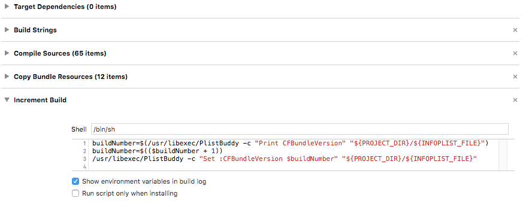

脚本:
```bash
buildNumber=$(/usr/libexec/PlistBuddy -c "Print CFBundleVersion" "${PROJECT_DIR}/${INFOPLIST_FILE}")  
buildNumber=$(($buildNumber + 1))  
/usr/libexec/PlistBuddy -c "Set :CFBundleVersion $buildNumber" "${PROJECT_DIR}/${INFOPLIST_FILE}"
```
To use this script, follow these steps:
1. Select your app target in the project overview.
2. Select **Build Phases**.
3. Add a new build phase ("**New Run Script Phase**").
4. Enter the above script in the appropriate field.
5. In your `Info.plist`, ensure the current build number is numeric (是的, 主要是保证你原来填写的确实是数字就行了)




来源: http://crunchybagel.com/auto-incrementing-build-numbers-in-xcode/

或者一些别的思考: 
http://stackoverflow.com/questions/9258344/better-way-of-incrementing-build-number
