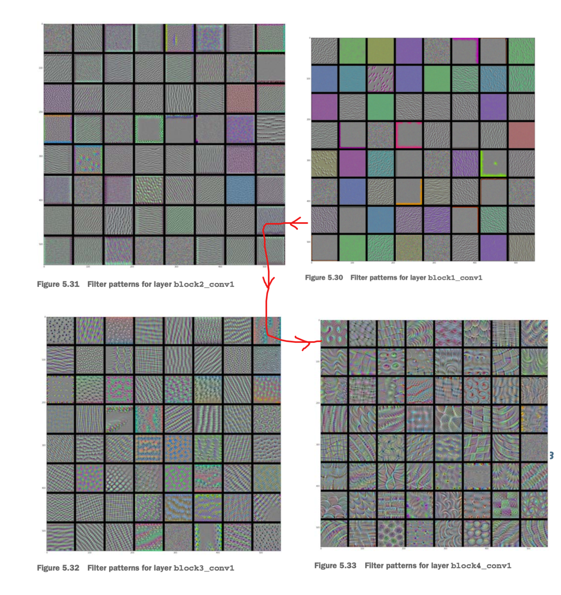
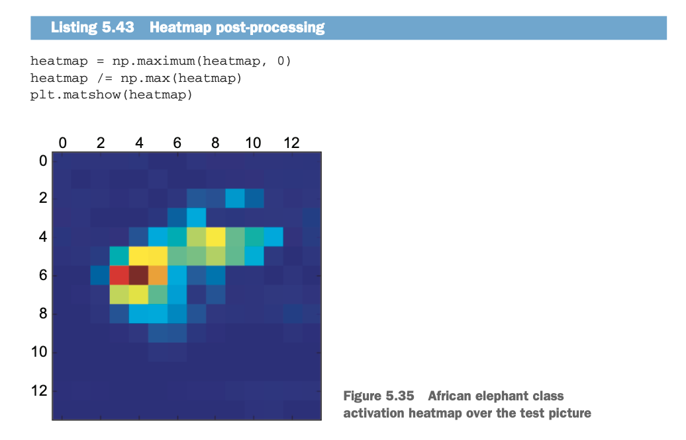

# Deep learning for computer vision

## Convolution Network

The convolution operation extracts patches from its input feature map and applies the same transformation to all of these patches, producing an output feature map. 

* convolution layers learn local patterns(局部特征)
    * The patterns they learn are translation invariant.（局部特征可在图片别的地方重复）
    * 有的教材里会说每个滑窗一个特征，然后引入**参数共享**才讲到一个特征其实可以用在所有滑窗
* They can learn spatial hierarchies of patterns(低级特征堆叠成高级特征)
* depth axis no longer stand for specific colors as in RGB input; rather, they stand for filters(表示图片时，3个通道有原始含义，卷积开始后通道只表示filter了)
* `valid` and `same` convolution（加不加padding让filter在最后一个像素时也能计算）
* `stride`，滑窗步长
* `max-pooling` or `average-pooling`
    * usually 2x2 windows by stride 2 -> 下采样(downsample)
    * 更大的感受野
    * 更小的输出
    * 不是唯一的下采样方式（比如在卷积中使用stride也可以）
    * 一般用max而不是average(寻找最强的表现)
* 小数据集
    * data augmenetation(旋转平衡缩放shear翻转等)
        * 不能产生当前数据集不存在的信息
        * 所以仍需要dropout
    * pretrained network(适用通用物体)
        * feature extraction
        * fine-tuneing

### Using a pretrained convnet

A pretrained network is a saved network that was previously trained **on a large dataset** typically on a large-scale image-classification task.

### Feature extraction

Feature extraction consists of using the representations learned by a previous network to extract interesting features from new samples. These features are then run through a *new classifier*, which is trained from scratch. 

1. 即只使用别的大型模型提取的representations（特征），来构建自己的分类器。
2. 原本模型的分类器不但是为特定任务写的，而且基本上丧失了位置和空间信息，只保留了对该任务上的presence probability.
3. 最初的层一般只能提取到线，边缘，颜色等低级特征，再往后会聚合出一些纹理，更高的层就可能会叠加出一些眼，耳等抽象的特征，所以你的识别对象与pretrained数据源差别很大的时候，就需要考虑把最尾巴的几层layer也舍弃掉。（e.g. VGG16最后一层提取了512个feature map）
4. 两种用法：
    * 跑一次预训练模型你选中的部分，把参数存起来（$\leftarrow$错），把输出当作dataset作为自己构建的分类器的input。
        * 快，省资源，但是需要把数据集固定住，等于没法做data augmentation
        * 跑预训练模型时不需要计算梯度(freeze)
        * 其实应用预训练模型就等于别人的预处理数据集，而真实的模型只有一个小分类器
    * 合并到自定义的网络中当成普通网络训练
        * 慢，但是能做数据增广了
        * 需手动设置来自预训练模型的梯度不需要计算梯度

> 注：这里为什么单独跑预训练模型不能数据增广呢？

> 教材用的是keras, 它处理数据的方式是做一个generaotr，只要你给定数据增广的规则（参数），哪怕只有一张图，它也是可以无穷无尽地给你生成下一张的。所以每一次训练都能有新的数据喂到网络里。这是出于内存考虑，不需要真的把数据全部加载到内存里。

> 而如果你是一个固定的数据集，比如几万条，那么你把所有的数据跑一遍把这个结果当成数据集（全放在内存里），那也不是不可以在这一步用数据增广。

### Fine-tuning

Fine-tuning consists of unfreezing a few of the top layers of a frozen model base used for feature extraction, and jointly training both the newly added part of the model (in this case, the fully connected classifier) and these top layers. This is called fine-tuning because it slightly adjusts the more abstract representations of the model being reused, in order to make them more relevant for the problem at hand.

前面的feature extraction方式，会把预训练的模型你选中的layers给freeze掉，即不计算梯度。这里之所以叫fine-tuning，意思就是会把最后几层(top-layers)给`unfreezing`掉，这样的好处是保留低级特征，重新训练高级特征，还保留了原来大型模型的结构，不需要自行构建。


> 但是： it’s only possible to fine-tune the top layers of the convolutional base once the classifier on `top has already been trained`. 预训练模型没有frezze住的话loss将会很大，所以变成了先train一个大体差不多的classifier，再联合起来train一遍高级特征和classifier:

1. Add your custom network on top of an already-trained base network.
2. Freeze the base network.
3. Train the part you added. (第一次train)
4. Unfreeze some layers in the base network.
5. Jointly train both these layers and the part you added.（第二次train）

但千万别把所有层都unfrezze来训练了
1. 低级特征都为边缘和颜色，无需重新训练
2. 小数据量训练大型模型，model capacity相当大，非常容易过拟合

### Visualizing what convents learn

并不是所有的深度学习都是黑盒子，至少对图像的卷积网络不是 -> `representations of visual concepts`, 下面介绍**三种**视觉化和可解释性的representations的方法。

#### Visualizing intermediate activations

就是把每个中间层(基本上是"卷积+池化+激活“)可视化出来，This gives a view into how an input is `decomposed` into the different filters learned by the network. 

```python
from keras import models
layer_outputs = [layer.output for layer in model.layers[:8]] activation_model = models.Model(inputs=model.input, outputs=layer_outputs)

activations = activation_model.predict(img_tensor)

import matplotlib.pyplot as plt
plt.matshow(first_layer_activation[0, :, :, 4], cmap='viridis')

# 注意使用的是matshow而不是show

```


以上代码是利用了keras的Model特性，将所有layers的输出**摊平**（就是做了一个多头的模型），然后再顺便取了第4和第7个feature map画出来，可以看到，图一感兴趣的是`对角线`，图二提取的是`蓝色的亮点`。

结构化这些输出，可以确信初始layer确实提取的是简单特征，越往后越高级（抽象）。

A deep neural network effectively acts as an `information distillation`(信息蒸馏) pipeline, with raw data going in (in this case, RGB pictures) and being repeatedly transformed so that irrelevant information is filtered out (for example, the specific visual appearance of the image), and useful information is `magnified and refined` (for example, the class of the image).

> 关键词：有用的信息被不断**放大和强化**

书里举了个有趣的例子，要你画一辆自行车。你画出来的并不是一辆充满细节的单车，而往往是你抽象出来的单车，你会用基本的线条勾勒出你对单车特征的理解，比如龙头，轮子等关键部件，以及相对位置。画家为什么能画得又真实又好看？那就是他们真的仔细观察了单车，他们绘画的时候用的并不是特征，而是一切细节，然而对于没有受过训练的普通人来说，往往只能用简单几笔勾勒出脑海中的单车的样子（其实并不是样子，而是特征的组合）

#### Visualizing convnet filters

通过强化filter对输出的反应并绘制出来，这是从数学方法上直接观察filter，看什么最能“刺激”一个filter，用”梯度上升“最能体现这种思路：

把output当成loss，用梯度上升（每次修改input_image）训练出来的output就是这个filter的极端情况，可以认为这个filter其实是在提取什么（responsive to）：


```python
from keras.applications import VGG16
from keras import backend as K
model = VGG16(weights='imagenet', include_top=False)
layer_name = 'block3_conv1'
filter_index = 0
layer_output = model.get_layer(layer_name).output
loss = K.mean(layer_output[:, :, :, filter_index])  # output就是loss

grads = K.gradients(loss, model.input)[0] # 对input求微分
grads /= (K.sqrt(K.mean(K.square(grads))) + 1e-5)

iterate = K.function([model.input], [loss, grads])
import numpy as np
# 理解静态图的用法
loss_value, grads_value = iterate([np.zeros((1, 150, 150, 3))])

input_img_data = np.random.random((1, 150, 150, 3)) * 20 + 128.
step = 1.
for i in range(40):
    loss_value, grads_value = iterate([input_img_data])
    input_img_data += grads_value * step  # 梯度上升

```
按上述代码的思路结构化输出并绘图：



从线条到纹理到物件（眼睛，毛皮，叶子）

> each layer in a convnet learns a collection of filters such that their inputs can be expressed as a `combination of the filters`.

> This is similar to how the Fourier transform decomposes signals onto a bank of cosine functions. 

用傅里叶变换来类比卷积网络每一层就是把input表示成一系列特征的组合。

#### Visualizing heatmaps of class activation

which parts of a given image led a convnet to its final classification decision. 即图像有哪一部分对最终的决策起了作用。

* `class activation map` (CAM) visualization,
* `Grad-CAM`: Visual Explanations from Deep Networks via Gradient-based Localization.”

>  you’re weighting a spatial map of “how intensely the input image activates different channels” by “how important each channel is with regard to the class,” resulting in a spatial map of “how intensely the input image activates the class.

解读上面这句话：

不同channels（特征）对图像的激活的强度  
\+  
每个特征对(鉴定为）该类别的重要程度  
\=  
该“类别”对图像的激活的强度


一张两只亚洲象的例图，使用VGG16来做分类，得到92.5%的置信度的亚洲象的判断，为了visualize哪个部分才是“最像亚洲象”的，使用`Grad-CAM`处理：

```python
from keras.applications.vgg16 import VGG16
model = VGG16(weights='imagenet')
african_e66lephant_output = model.output[:, 386]  # 亚洲象在IMGNET的类别是386
last_conv_layer = model.get_layer('block5_conv3') # top conv layer

grads = K.gradients(african_elephant_output, last_conv_layer.output)[0] 
pooled_grads = K.mean(grads, axis=(0, 1, 2))
iterate = K.function([model.input],
                     [pooled_grads, last_conv_layer.output[0]])
pooled_grads_value, conv_layer_output_value = iterate([x])
for i in range(512):
    conv_layer_output_value[:, :, i] *= pooled_grads_value[i]
heatmap = np.mean(conv_layer_output_value, axis=-1)
```


叠加到原图上去（用cv2融合两张图片，即相同维度的数组以不同权重逐像素相加）：

