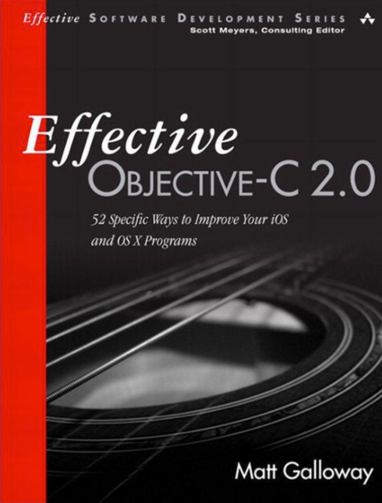

> 这个书当然中文版的，也很经典，我也读过了，但是嘛，老规矩，有原版还是读一遍原版，再加上英文水平也只有那么好，有机会能多读读在就多读读吧。一共就7章，52节，200多页，并不多。
> 此外，因为很多名词其实我们平时直接叫的就是英文，中文版里统统都给了一个中文翻译，反而更陌生了，有种“访达”的即视感。

# Chapter 1: Accustoming Yourself to Objective-C

## Item 1: Familiarize Yourself with Objective-C’s Roots

1. `messaging structure` v.s. `function callihng`
    * in messaging structure, the **runtime** decides which code gets executed, while in function, the  **compiler** decides.
    * `dynamic binding` v.s. `virtual table`  <= 多态
2. `runtime component` v.s. `compiler`
    * 含有所有让面向对象的OC能工作的 *data structures* and *functions*
        * 比如，含有所有的memory-management methods
    * 更新runtime component就能提升性能，而无需重新编译
3. Objective-C is a superset of C
    * 所以语法基本类似：`NSString *str = @"The String`
    * 表示声明了一个变量，类型是*NSString \**，是一个指向NSString的指针
    * 所有OC对象必须如此声明，对象内存也总是分配在heap space上
        * 这是分配到stack上：`NSString stackString` <- 报错
    * 但指向这个对象的指针（**pointer**）是分配在`stack frame`里的，多个指向同一对象的指针就分配了多个内存
        * 每个内存大小就是一枚指针的大小
        * 值也是一样
4. The memory allocated in the `heap` has to be **managed directly**
    * OC将堆内存管理抽象了出来，`runtime`进一步抽象成一套内存管理架构：`reference counting`
5. 整个系统框架都要使用结构体，用对象会有额外的开销

## Item 2: Minimize Importing Headers in Headers

Objective-C, just like C and C++, makes use of `header files` and implementation files.

1. `forward declaring` -> `@class SomeClass`
    * 头文件里并不知道知道一些类的实现细节，只需要知道有这么一个类就行了
    * 但是`.m`文件里就要自行去import一次这个class了
    * 原则就是尽量延后引入头文件的时机，减少编译时间
    * 还解决了互相引用的问题
    * 引用`super class`, `protocol`等必须要知道细节，不能应用`forward declaring`
        * 所以最好把protocol单独放在一个头文件，避免无谓地引用大文件，增加编译时间
        * 但是`delegate`放到`class-continuation category`里面写更好（即在**.m**文件里写protocol和import），无需暴露到公共头文件
    * 关键词：`减小依赖`，`缩减编译时间`

## Item 3: Prefer Literal Syntax over the Equivalent Methods

* 尽量使用字面量语法（`Literal Syntax`）创建和使用对象
* 字面量语法只是一个语法糖（`syntactic sugar`），推荐使用字面量，会减少代码量，但最好知道它对应的原始方法。（但是还是会有所区别，看下例）
* 用字面量初始数组，如果不是最后一个元素是nil，会报错，而原始的`arrayWithObjects:`方法则会在碰到第一个nil时当成是终止参数而正常执行（只保留nil前的元素初始化数组）
    * 作者说这反而是好事，未预料到的情况成功执行比报错更可怕，抛异常能更早地发现错误
* 只能创建Foundation框架的对象，自定义对象不行（一般也没必要）
* 使用字面量语法创建出来的String, Array, Dict等都`immutable`的

## Item 4: Prefer Typed Constants to Preprocessor \#define

* `#define`本质是替换
* `#define`出来的是没有类型信息的
* 如果是声明在头文件中，引用了此头文件的代码都会应用此替换
    * 即使被重定义了，编译器也不会产生警告
* 而常量就带了类型信息
    * `static NSString * const MyStringConstants = "Hello world;`
    * 注意星号的位置，这里表示指针指向的是整个常量
    * 如果把星号写到const后，那表示指针就是那个常量...
* 定义常量的位置很重要（预处理指令也一样），不打算公开的话就在`.m`文件里定义
* 命令也很重要
* 否则成了全局变量，很可能”不经意“引起变量冲突/覆盖
* `static const`要一起使用，单独的`const`会报错
    * `static`不再是别的语言中的**静态变量**，而保是一个作用域声明
    * 一个编译单元（`translation unit`）个输出一个目标文件（`object file`）
        * 考虑你编译一个c++文件，一个文件生成一个目标（二进制）文件，然后再链接。
        * 所以一个编译单元一般是一个`.m`文件
    * 结合起来，`static`就是在一个目标文件内可见
    * 如果不加`static`，编译器会添加一个`external symbol`（后面有详述），这样就有重定义风险了（`duplicate symbol `）
* 最后，事实上`static const`一起用，编译器做的仍然是**替换**，而没有去创建符号（但此时已经有类型信息了）
*如果需要公开，则添加到全局符号表（`global symbol table`）中：
```objective-c
// In the header file
extern NSString *const EOCStringConstant;

// In the implementation file
NSString *const EOCStringConstant = @"VALUE";
```

* 上面解释了`static`，现在来解释`extern`
    * `extern`表示向编译器保证全局符号表中将会有这个符号，其实就是要编译器不要继续检查
    * 它知道链接成二进制文件后，肯定能找到这个常量
* 所以在`.m`文件里正常定义和赋值，在**任意**`.h`文件时给编译器打个招呼就行了
* 命名规范：
    * 如果是限定可见域的，用`k`开头就行了
    * 如果会公开的，那么就用函数名作前缀（系统框架都是这么做的）

**external symbol** V.S. **global symbol**
> 前文你已经知道了两种提升作用域的方式，区别在
> * 一个是通过不对const加static（添加external symbol），
> * 一个是额外声明extern（添加到blobal symbol talbe）

## Item 5: Use Enumerations for States, Options, and Status Codes

* 枚举只是一种常量命名方式
* 语法很奇葩：`enum EOCConnectionState` state = EOCConnectionStateDisconnected; 
    * 看高亮的部分，别人只要写一个type，它要连enum带名称写全
* 所以一般会`typedef`一下：`typedef enum EOCConnectionState EOCConnectionState;`
    * 现在就可以用`EOCConnectionState`这个type来定义变量了
* 用enum来做选项(options)的时候，因为不是互斥的关系，选择bitwise OR operator来会直观很多（就是每一个二进制位代表一个状态）
```objective-c
enum UIViewAutoresizing { 
    UIViewAutoresizingNone = 0, 
    UIViewAutoresizingFlexibleLeftMargin = 1 << 0, 
    UIViewAutoresizingFlexibleWidth = 1 << 1, 
    UIViewAutoresizingFlexibleRightMargin = 1 << 2, 
    UIViewAutoresizingFlexibleTopMargin = 1 << 3, 
    UIViewAutoresizingFlexibleHeight = 1 << 4, 
    UIViewAutoresizingFlexibleBottomMargin = 1 << 5,
}
```


* Foundation框架定义了一些辅助宏，以便支持新的C++标准对宏定义的增强同时还能兼容老的标准: `NS_ENUM`和`NS_OPTIONS`
    * 特别是c++对枚举值里的bitwise操作结果需要显式转换
    * 所以用到了**可组合**的option类的枚举，最好用`NS_OPTIONS`宏，否则用`NS_ENUM`就够了
* 对enum应用`switch`最好不要加`default`，这样你添加了新的枚举值而忘记了处理，能及时得到错误反馈

# Chapter 2: Objects, Messaging, and the Runtime

## Item 6: Understand Properties

* `Properties` are an Objective-C feature providing encapsulation of the data an object contains. 
    * stored by `instance variables`
    * accessed through `accessor methods` (getter, setter)
        * can be written by complier automatically <= `autosynthesis`
        * introduced a `dot syntax` to  accessing the data

看一下C++写法：
```cpp
@interface EOCPerson : NSObject { 
@public
    NSString *_firstName;
    NSString *_lastName; 
@private
    NSString *_someInternalData; 
}
@end
```
* 对象布局在编译期就确定了，所以就硬编码了每个属性在对象内存中的偏移量
* 所以如果对象布局变化了（比如增加了实例变量），这些偏移量就会出错，必须要重新编译。
    * 如果链接代码时使用了不同版本的类定义，就会产生这种“不兼容”的问题
* OC的解决方案是，把偏移量仍由“实例变量”存储
    * 但是交由“类对象“(class object)保管
    * 偏移量在运行期查找 -> 类的定义变了，偏移量也就变了（实时的）
        * 甚至可以在运行期向类中新增实例变量
        * nonfragile Application Binary Interface(ABI)
        * 这样就可以不止在声明文件里定义实例变量，还可以在class-continuation和实现文件里面定义了
    * 尽量不要直接访问实例变量
* 使用`点语法`访问属性
    * 编译器会转换为对存取方法的调用
    * 编译器会为属性生成相应的实例变量，并自动合成（生成相应的存取方法）
        * 编译期进行，所以你看不到实际的代码
        * 也可以手写同样的代码（这时你就可以自定义实例方法的签名了）
        * `@dynamic`能阻止合成 <= 相信运行期能找到

### Property Attributes

1. 原子性(`Atomicity`)，读写的时候加锁
2. 读/写权限
3. 内存管理语义
    * assign: on scalar type
    * strong: 拥有关系，设置新值流程：retain new -> release old -> set new
    * weak: 非拥有关系
    * unsafe_unretained: 类似assign，但适用于对象类型（而不只有scalar type)
        * 与weak的区别在目标对象在销毁时，该属性值不会自动清空
    * copy: 类似strong，但是相比起retain，它直接是复制了一份，通常用于拥有可变类型的变量，比如`NSString *`，可变版的string也能赋值给NSString，这就会引起赋值后值还自己变了的可能性
4. 方法名
    * getter=<name>，需要注意的是有些bool类型的通常会设置为`isXXXX`
    * setter=<name>，但很少这么做

如果自己来实现accessor methods，那么就要自己去保证这些方法符合这些attributes，比如内存管理语义为copy，那么在设置的时候就要拷贝传入的值：
```objective-c
@interface EOCPerson : NSManagedObject 
@property (copy) NSString *firstName;
@property (copy) NSString *lastName;
- (id)initWithFirstName:(NSString*)firstName lastName:(NSString*)lastName;
@end

// 实现文件：
- (id)initWithFirstName:(NSString*)firstName lastName:(NSString*)lastName
{
    if ((self = [super init])) {
        _firstName = [firstName copy];
        _lastName = [lastName copy]; }
        return self; 
    }
```

> * 读写操作的原子性并不是线程安全
> * iOS中使用同步锁开销较大
> * 实际iOS程序碰到多线程读写属性的场景也非常少
> * 所以基本上都是声明为`nonatomic`

## Item 7: Access Instance Variables Primarily Directly When Accessing Them Internally

在对象内部优先访问实例变量。

直接访问而不用点语法的影响：
* 不经过消息派发，速度快（编译器生成的代码会直接访问相应的内存）
* 不会调用setter，也绕过了相应的内存管理语义
* 不会触发KVO
* 没有机会在getter, setter中设置断点来调试
* 没有机会`lazy intialization`，而getter机制能在首次被调用到的时候才去初始化实例变量
* 初始化和dealloc的时候总是要直接用实例变量

作者建议尽量在读取实例变量的时候直接访问，设置的时候用属性（会自动考虑内存管理语义）

## Item 8: Understand Object Equality

其实就是理解NSObject自带的`isEqual:`方法。

* `==`就是比指针
* `isEqual:`比的是`hash`，所以自定义的类要实现equality就要自行实现这两个方法
    * hash不同必然对象不同，但由于有hash collisions的存在，反过来并不成立
    * 尽量用对象的不可变部分来做hash

一个做hash的方法：
```objective-c

- (NSUInteger)hash {
    NSUInteger firstNameHash = [_firstName hash]; 
    NSUInteger lastNameHash = [_lastName hash]; 
    NSUInteger ageHash = _age;
    return firstNameHash ^ lastNameHash ^ ageHash;
}
```

## Item 9: Use the Class Cluster Pattern to Hide Implementation Detail

```objective-c
+ (UIButton*)buttonWithType:(UIButtonType)type;
```
* 作者将上述这种解释为“类族”，即它的返回值可能是各种button，但归根结底，都是`UIButton`，就是靠着switch各种type来实例化各种子类。
* 同时，因为OC没有abstract class，为了避免直接使用抽象基类，一般不提供init方法，并在基类相关方法里干脆抛异常
* 这里使用`isMemberOfClass`就要小心，它是kind，但不一定是member
* 系统框架里有很多`class cluster`，特别是`collection`
    * 所以`if([anArray class] == [NSArray class])`是false（原因就是它是被当作“**抽象基类**来设计的，实际上是隐藏在公共接口后面的某个内部类型）
    * 同样，用`isKindOfClass:`至少能判断是在这个类族里

## Item 10: Use Associated Objects to Attach Custom Data to Existing Classes

扩展现有类，我们可以继承，但有时候一些特殊机制创建的类却无法继承，可以通过`Associated Object`来添加这些信息。

* 以键值对来存储，所以是可以存储多个关联数据的
* 可以指定storage policy，对应内存管理语义


方法:
```objective-c
// Sets up an association of object to value with the given key and policy.
void objc_setAssociatedObject(id object, void *key, id value, objc_AssociationPolicy policy)

// Retrieves the value for the association on object with the given key.
id objc_getAssociatedObject(id object, void *key)

// Removes all associations against object.
void objc_removeAssociatedObjects(id object)
```


书中写了一个例子，alertView的代理方法来处理按了什么键，而一个页面中如果有多个alertView，且用同一个代理对象，那么处理需要更精细（比如需要知道是哪个警告框弹的，我一般用tag）。
而如果把处理方法定义为一个block，并把它关联到UIAlertView类，那么处理逻辑就可以跟定义alertView写在一起了。

todo, item 11-14
