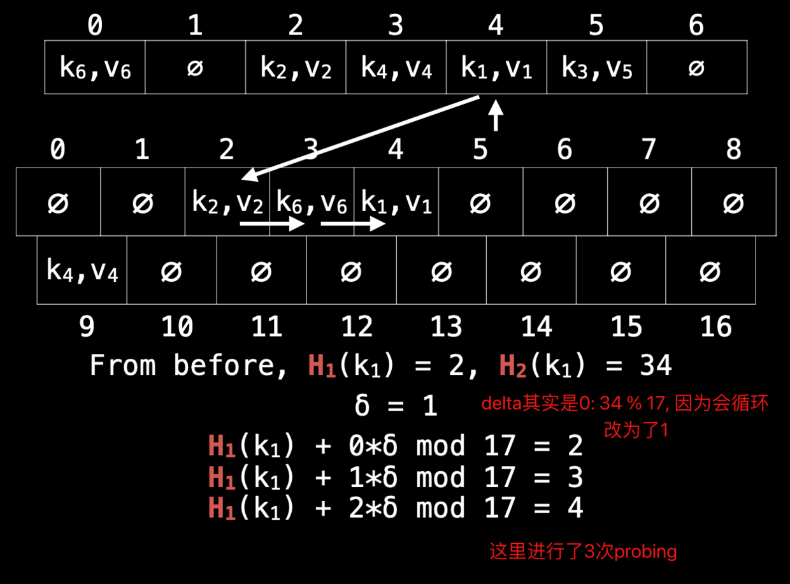
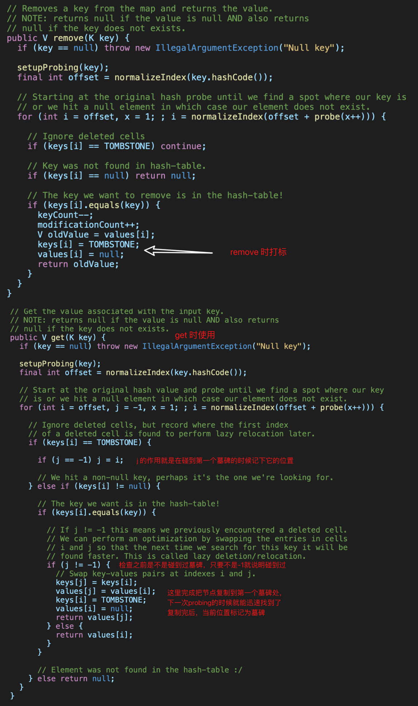

这是一位 google 工程师分享的8小时的[数据结构](https://www.youtube.com/watch?v=RBSGKlAvoiM)的视频,我的笔记

-----

# Hash Tables

* key-value pair
* using `Hashing` technique
* often used tracking item frequencies

what's *hash function*?
- maps a key `x` to a whole number in a fixed `range`.
    - e.g. $H(x) = (x^2 - 6x + 9) % 10$ maps (0, 9)
    - 这个方程会为不同的x产生一样的y -> `hash collision`
- can hash arbitrary objects like string, list, tuple...
- must be `deterministic`(确定的x产生确定的y)
    - 因此key的应该是`immutable`的类型

关键词是`range`，你设计的function总要mod一下，将结果限制在一个范围内。这里你应该暂时能推测出hashtable的key可能就是数字吧？

**hash collision**

* `separate chaining`
用一种数据结构（通常是链表）保留所有冲突的值
* `open addressing`
为冲突的值选择一个offset（地址/值）保存 -> `probing sequence P(x)`

不管是怎么解决冲突，**worst**的情况下，hash table的操作时间也会由O(1)变成O(n)

怎么用HT来查找呢？不是把hash后的结果拼到原数据上，而是每次查询前，对key进行一次hash function，就能去查询了。

## Open Addressing

**probing sequences**
* linear probing: P(x) = ax + b
* quadratic probing: p(x) = $ax^2 + bx + c$
* double hashing: p(k, x) = $x * H_2(k)$ 双重hash
* pseudo random number generator: p(k, x) = x * rng(H(k), x) 用H(k)(即hash value)做种的随机数

总之就是在这样一个序列里找下一个位置

假设一个table size 为N的HT，使用开放寻址的伪代码：
```python
x = 1
keyHash = H(k)   # 直接计算出来的hash value
index = keyHash  # 偏移过后存在HT里的index

while table[index] != None:
    index = (keyHash + P(k, x)) % N  # 加上偏移，考虑size（N）
    x += 1 # 游标加1

# now can insert (k,v) at table[index]
```

### Chaos with cycles

**Linear Probling (LP)**

LP中，如果你*运气不好*，产生的序列的下一个值永远是occupied的状态（一般是值域小于size），就进入死循环了。

假设p(x) = 3x, H(k) = 4, N = 9
那么H(k)+P(x) % N 只会产生{4,7,1}，如果这三个位置被占用，那就陷入了永远寻找下一个的无限循环中。

一般是限制probing function能返回刚好N个值。
> 当p(x)=ax的a与size的N互质，即没有公约数，`GCD(a, N) = 1`一般能产生刚好N个值。(Greatest Common Denominator)

>注意，为了性能和效率的平衡，有`load factor`的存在，所以到了阈值，size就要加倍，N的变化，将会使得`GCD(a, N) = 1`的a的选择有变化，而且之前对N取模，现在取值也变发生变化，这时候需要重新map

重新map不再按元素当初添加的顺序，而是把现有HT里的值按索引顺序重新map一遍。比如第一个是k6, 即第6个添加进来的，但是现在第一个就重新计算它的值，填到新的HT里面去。

**Quadratic Probing （QP）**

QP 同样有chaos with cycles的问题，通用解决办法，三种：
1. p(x) = $x^2$, size选一个 prime number > 3, and $\alpha \leq \frac{1}{2}$ 
2. p(x) = $(x^2 + x) / 2$, keep the size a power of 2 （不需要是素数了）
3. p(x)= $(-1^x) \times x^2$, make size prime N $\equiv 3$ mod 4 ???

**Double Hashing**

Double Hashing: P(x) = $x \times H_2(k)$可见仍然类似一个一次的线性方程，$H_2(k)$就类似于ax中的a，设为$\delta$，相比固定的a, 这里只是变成了动态的，这样不同的key的待选序列就是不一样的（可以理解为系数不同了）

解决chaos:
1. size N to be a prime number
2. calculate: $\delta = H_2(k)$ mod N
    * $\delta=0$ 时offset就没了，所以需要人为改为1
    * $1 \leq \delta \lt N$ and GCD($\delta$, N) = 1

可见，虽然系数是“动态”的了，但是取值还是（1，N）中的一个而已，hash只是让其动起来的一个原因，而不是参与计算的值。

我们本来就是在求hash value，结果又要引入另一个hash function，显然这个$H_2$不能像外层这样复杂，一般是针对常见的key类型(string, int...-> fundamental data type)的`universal hash functions`

>因为N要是一个素数，所以在double size的时候，还要继续往上找直到找到一个素数为止，比如N=7, double后，N=14，那么最终，N=17

### Issues with removing

因为冲突的hash value需要probing，probing的依据是从序列里依次取出下一个位置，检查这个位置**有没有被占用**，那么问题就来了，如果一个本被占用的位置，因为元素需要删除，反而变成没有占用了，这有点类似删除树节点，不但要考虑删除，还要考虑这个位置怎么接续。

**lazy deletion**
但HT机制比树要复杂，为了避免反复应用probing函数重新摆放后续所有节点，干脆就在删除的位置放置一个预设的标识，我们称为墓碑(`tombstone`)，而不是直接置空，然后所有的查找和添加加上这一条规则，就能快速删除又无需重新排序。

大量删除会造成空间浪费，但无需立即处理：
1. 添加元素允许添加到墓碑位置
2. 到达阈值容量需要倍增的时候有一次重排，这个时候就可以移除所有的墓碑

如果查找一个hash value，连续3个都是墓碑，第4个才是它，这是不是有点浪费时间？
确实，所以还可以优化，当你查找过一次之后，就可以把它移到第一个墓碑的位置，这样，**下次**查询的时候速度就会快很多了。

整个机制，叫`lazy deletion`


