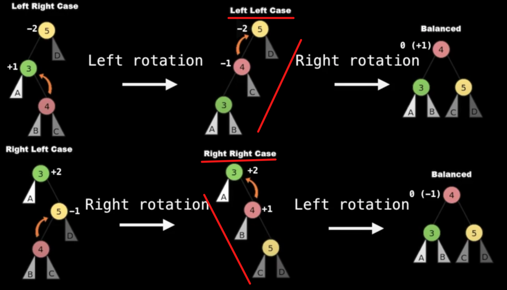

这是一位 google 工程师分享的8小时的[数据结构](https://www.youtube.com/watch?v=RBSGKlAvoiM)的视频,我的笔记

-----

# Balanced Binary Search Trees (BBST)

* 满足low (logarithmic) height for fast insertions and deletions
* clever usage of a `tree invairant` and `tree rotation`

## AVL Tree

一种BBST，满足O(log n)的插入删除和查找复杂度，也是第一种BBST，后续出现的更多的：2-3 tree, AA tree, scapegoat tree, red-black tree(avl的最主要竞争对手)

能保持平衡的因子：Balance Factor (`BF`)

* BF(node) = H(node.right) - H(node.left)
* H(x) = height of node = # of edges between (x, furthest leaf)
* 平衡就是左右平均分配，所以要么均分，要么某一边多一个，BF其实就是(-1, 0, 1)里的一个了 <- avl tree invariant

一个node需要存：
* 本身的(comparable) value
* balance factor
* the `height` of this node
* left/right pointer

使树保持左右平衡主要是靠rotation，极简情况下（三个node），我们有两种基本情况（left-left, right-right），有其它情况就旋转一次变成这两种情况之一：


## Insertion
一次插入需要考虑的是，插在哪边，以及插入后对bf, height和balance的破坏


其中修复平衡就是上图中几个基本结构的转换

## Removal

avl树就是一棵BST，删除节点分两步：
1. 按照bst的方法查找节点，即小的在左边找，大的在右边找
2. 也按bst的原则删除元素，即找到元素后，把左边的最大值或右边的最小值拿过来补上删除的位置
3. 这一步是多出来的，显然是要更新一下节点的bf和height，及重新balance一次了。

前两部分参考BST一章，流程伪代码：
```python
function remove(node, value): ...
    # Code for BST item removal here
    ...
    # Update balance factor
    update(node)
    # Rebalance tree
    return balance(node)
```
