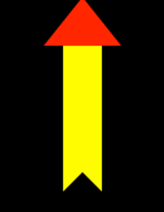
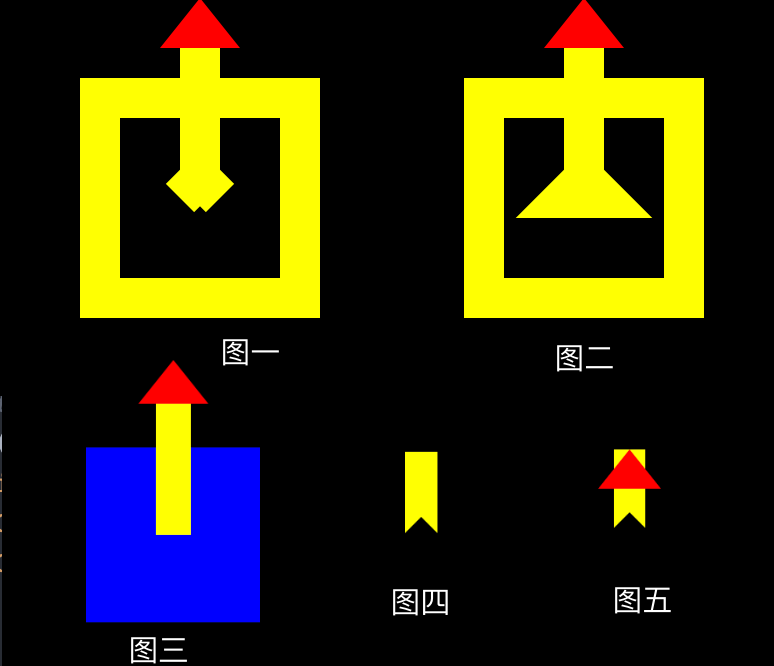
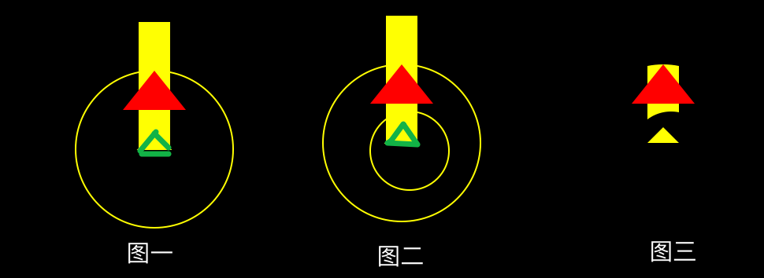

先来看一个例子

画一个箭头，其中箭尾有分叉，一般来说，是画一个三角，画一个矩形（实心矩形一般也直接用很粗的线条），最后再叠一个三角（with `  CGBlendModel.clear`)，这里就不多介绍了：
```swift
override func draw(_ rect: CGRect) {       
    let p = UIBezierPath()
    // shaft
    UIColor.yellow.set()
    p.move(to:CGPoint(100,100))
    p.addLine(to:CGPoint(100, 19))
    p.lineWidth = 20
    p.stroke()
    
    // point
    UIColor.red.set()
    p.removeAllPoints()
    p.move(to:CGPoint(80,25))
    p.addLine(to:CGPoint(100, 0))
    p.addLine(to:CGPoint(120, 25))
    p.fill()
    
    // snip
    p.removeAllPoints()
    p.move(to:CGPoint(90,101))
    p.addLine(to:CGPoint(100, 90))
    p.addLine(to:CGPoint(110, 101))
    p.fill(with:CGBlendMode.clear, alpha:1.0)
}
```
我们来看看`clipping`怎么用
1. fill三角箭头（出于堆叠上目的可以最后画）
2. 找到箭尾的三个顶点
    * 用`boundingBoxOfClipPath`来创建整个画板大小的矩形
    * 应用`clipping`把小三角挖掉
3，画一根黄色箭柄粗细的线（从底向上）
    * 因为小三角区域被clipping掉了，结果就成了图示的模样

```swift
override func draw(_ rect: CGRect) {
        // obtain the current graphics context
        let con = UIGraphicsGetCurrentContext()!
        
        // punch triangular hole in context clipping region
        con.move(to:CGPoint(x:90, y:100))
        con.addLine(to:CGPoint(x:100, y:90))
        con.addLine(to:CGPoint(x:110, y:100))
        con.closePath()
        // 添加整个区域为rect
        // 然后再clip设定为不渲染的区域
        // 后续的渲染全会避开这个区域
        // 我们后面把这个rect设为蓝色试试(顺便改为一个小一点的rect)
        con.addRect(con.boundingBoxOfClipPath)
        con.clip(using:.evenOdd)
//        con.fillPath()
        
        // draw the vertical line
        con.setStrokeColor(UIColor.yellow.cgColor)
        con.move(to:CGPoint(x:100, y:100))
        con.addLine(to:CGPoint(x:100, y:19))
        con.setLineWidth(20)
        con.strokePath()
   
        // draw the red triangle, the point of the arrow
        con.setFillColor(UIColor.red.cgColor)
        con.move(to:CGPoint(x:80, y:25))
        con.addLine(to:CGPoint(x:100, y:0))
        con.addLine(to:CGPoint(x:120, y:25))
        con.fillPath()
    }
```
能够完美run起来，但是我对clipping的机制还是有点不理解，一些关键点的讲解，和我的问题，一条条过：
1. 我们用构建了箭尾的三角形，然后`closePath`，那是因为我们只画了两条线，如果事实上第三条线连回了原点，那么这个`closePath`就不需要了
  * （图一）演示了不close的话就直接只有两条线了
2. 我想看看clipping到底发生了啥，于是注释掉了clip的那一行，得到了（图二）
  * 之所以长那样是因为随后设置了stroke的参数（20像素的黄色）
  * stroke时，画板上有三个元素：一个三角，一个矩形，一条线段，全部用20宽的黄线描边了，一切如预期
3. 于是我尝试添加rect时只取了中间一小块，并涂成蓝色，不clip试试，得到（图三）。
4. 知道了新rect的位置，把clip加回来，发现箭尾有了，箭头却没了（图四）
5. rect与clip的关系已经出来了，尝试把红三角的y通通加50，移到了蓝矩形范围内，得到证明（图五）


那么clipping到底能对哪些起作用呢？是上面的rect吗？**当然不是**！

在clip方法被调用的时候，画布里有多少封闭元素，就会被应用clip。由于我们选择的是`evenOdd`模式，那么就会简单计数，某像素覆盖奇数次显示，偶数次则不显示。

上例中，`con.clip(using:)`方法调用时，画布里有两个封闭元素，一个三角，一个矩形，三角包在矩形里，那么计数为2，就不予显示了。

>事实上，判定奇偶的依据是该点向外做无限长的射线，判定有几条边与射线相交。同时，同样的设定可以用来解释`.winding`模式，即不但与相交的边有交，还与相交时，那条边是顺时针方向绘制的（+1）还是逆时针方向绘制的（-1）,总结果为0则不填充。[参考](https://www.jianshu.com/p/5cf8048b083b)

那就玩一玩验证下吧
1. 把矩形改成了圆圈，线宽也改小一点，得到（图一）*绿色三角形是我后加的，因为被黄实线盖住了*
2. 再在里面添加了一个小圆，得到（图二）
3. 这时候按照奇偶原则，小圆里的像素是偶数，而小圆里的三角则是奇数了，那么应该就只有大圆减掉小圆的部分，和小圆内的三角会被渲染了（图三），与预期一致



现在再来回顾书上先套一个画布大小的矩形，再画一个三角形，你大概应该知道目的了（凑奇偶），我们矩形区域过小时绘制不了红色三角，纯粹也是因为奇数，往下移到矩形区域内，立马变偶数了。(当然，要在原位置渲染我们可以先中止clip:`con.resetClip()`再绘图）
