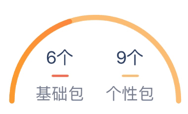
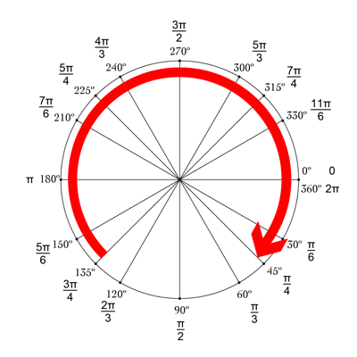

如果CALayer只有一个简单的 path, 那么直接给 path 赋值是最简单的:
```
shapeLayer = [CAShapeLayer layer];
shapeLayer.bounds = self.bounds;
shapeLayer.anchorPoint = CGPointMake(0, 0);
    
CGFloat endAngle = (1+_percentage)*M_PI;
shapeLayer.path = [UIBezierPath bezierPathWithArcCenter:center
                                                 radius:radius
                                             startAngle:startAngle
                                               endAngle:endAngle
                                              clockwise:YES].CGPath;
shapeLayer.strokeColor = _highlightColor.CGColor;
shapeLayer.fillColor = [UIColor clearColor].CGColor;
shapeLayer.lineWidth = arcWidth;
shapeLayer.lineCap = kCALineCapRound;
[self.layer addSublayer:shapeLayer];         
```

对 线条类的 path 可以应用`strokeEnd`属性来绘制动画:

```
CASpringAnimation *pathAnimation = [CASpringAnimation animationWithKeyPath:@"strokeEnd"];
pathAnimation.fromValue = [NSNumber numberWithFloat:0.0f];
pathAnimation.toValue = [NSNumber numberWithFloat:1.0f];
pathAnimation.mass = 4.0f;              // 物体质量 1
pathAnimation.stiffness = 200;          // 弹簧刚性 100
pathAnimation.damping = 20;             // 弹簧阻尼 10
pathAnimation.initialVelocity = 1.0f;  // 初始速度 0
pathAnimation.duration = pathAnimation.settlingDuration;
pathAnimation.timingFunction = [CAMediaTimingFunction functionWithName:kCAMediaTimingFunctionLinear];
[shapeLayer addAnimation:pathAnimation forKey:@"strokeEndAnimation"];
```
再加点渐变吧

```
// 增加渐变图层
CAGradientLayer *gradientLayer = [CAGradientLayer layer];
gradientLayer.frame = self.bounds;
gradientLayer.colors = gradientColorSet;
gradientLayer.startPoint = CGPointMake(1,0);
gradientLayer.endPoint = CGPointMake(0, _percentage);

[self.layer addSublayer:gradientLayer];
// [self.layer addSublayer:shapeLayer]; // 移除之前的图层
gradientLayer.mask = shapeLayer; // 当作渐变图层的 mask
```
组合效果如下:


要绘制弧形, 对照这个图就很简单了:


补充知识:

1, `CALayer`的动画用不了`animateWithDuration:animations:completion:`怎么办?
>因为这是`UIView`的方法, 你要把它加到一个`CATransaction`里面去

2, 即使加到`CATransaction`里面了, 怎么我对`frame`做的动画还是没有生效?
>因为`frame`是一个复合属性, 它由`position`, `bounds`等属性决定, 所以你只是用错了属性.

示例:
```
    [CATransaction begin];
    [CATransaction setCompletionBlock:^{
        // 完成回调
    }];
    CABasicAnimation *animation = [CABasicAnimation animationWithKeyPath:@"bounds.size.width"];
    animation.duration = self.defaultLayoutTransitionDuration;
    animation.fromValue = @(0.0f); 
    animation.toValue = @(finalFrame.size.width); 
    animation.timingFunction = [CAMediaTimingFunction functionWithName:kCAMediaTimingFunctionEaseOut];
    [line.layer addAnimation:animation forKey:@"lineLayerAnimation"];
    line.bounds = finalFrame;
    [CATransaction commit];
```

其它有关 CALayer 的不同**生命周期**里绘制的解说请参考[这篇文章](http://blog.csdn.net/kyfxbl/article/details/50640978), 全文转载如下

在iOS中绘图，可以使用`UIView`，也可以使用`CALayer`。实际上，UIView也是由底层的CALayer完成绘制的工作

#UIView和CALayer的关系

每个UIView内部都有一个CALayer对象，由它来完成绘制的工作。和view一样，layer也是一个树形的结构

当不需要自定义组件的时候，用UIView的API就足以胜任，把需要的子view通过addSubview()方法放到view的层次里即可；但是如果需要自己绘制一些图形，就需要在UIView的drawRect()方法或是CALayer的相关方法中，调用CoreGraphics的API来画图

跟几个朋友也讨论过这个问题，我认为用layer来画是更好的办法，因为相对于view，layer是更轻量级的组件，可以节省系统资源。同时layer是动画的基本单元，加动画特效也更容易。并且view负责响应手势等，把绘制的代码都放在layer里，逻辑上也更加清晰

但是需要注意，layer不能直接响应触摸事件，所以手势识别还是需要通过view来完成
在UIView中绘图

在UIView中绘图非常简单，当调用

```
self.setNeedsDisplay()
```

iOS系统会自动调用view上的`drawRect()`方法，可以在`drawRect()`方法中绘制图形
在CALayer中绘图

在layer中绘图，生命周期比view复杂一些

首先也是调用layer上的`setNeedsDisplay()`触发的

#display

首先会进入layer的`display()`方法，在这里可以把CGImage赋给layer的contents，那么会直接把该CGImage作为此layer的样式，不会进入后续的方法

```
// 绘图方法
override func display() {

    if let img = getFrameImage(wheelStyle) {
        contents = img.CGImage
    }        
}
```

#displayLayer

如果没有实现display()方法，或者调用了super.display()，并且设置了layer的`delegate`，那么iOS系统会调用delegate的`displayLayer()`方法

```
let myLayer : MyLayer = MyLayer()
myLayer.delegate = self;
myLayer.frame = bounds;

override func displayLayer(layer: CALayer) {

    if let img = getFrameImage(wheelStyle) {
        contents = img.CGImage
    }
}
```

#drawInContext

如果没有设置delegate，或者delegate没有实现`displayLayer()`方法，那么接下来会调用layer的`drawInContext`方法

```
override func drawInContext(ctx: CGContext) {

    CGContextSetLineWidth(ctx, 1);
    CGContextMoveToPoint(ctx, 80, 40);
    CGContextAddLineToPoint(ctx, 80, 140);
    CGContextStrokePath(ctx);
}
```

#drawLayerInContext

如果layer没有实现`drawInContext`方法，那么接下来就会调用delegate的`drawLayerInContext`方法

```
override func drawLayer(layer: CALayer, inContext ctx: CGContext) {
    CGContextSetLineWidth(ctx, 1);
    CGContextMoveToPoint(ctx, 80, 40);
    CGContextAddLineToPoint(ctx, 80, 140);
    CGContextStrokePath(ctx);
}
```

#总结

所以，一般来说，可以在layer的`display()`或者`drawInContext()`方法中来绘制

在display()中绘制的话，可以直接给contents属性赋值一个CGImage，在`drawInContext()`里就是各种调用CoreGraphics的API

假如绘制的逻辑特别复杂，希望能从layer中剥离出来，那么可以给layer设置delegate，把相关的绘制代码写在delegate的`displayLayer()`和`drawLayerInContext()`方法。这2个方法与`display()`和`drawInContext()`是分别一一对应的
